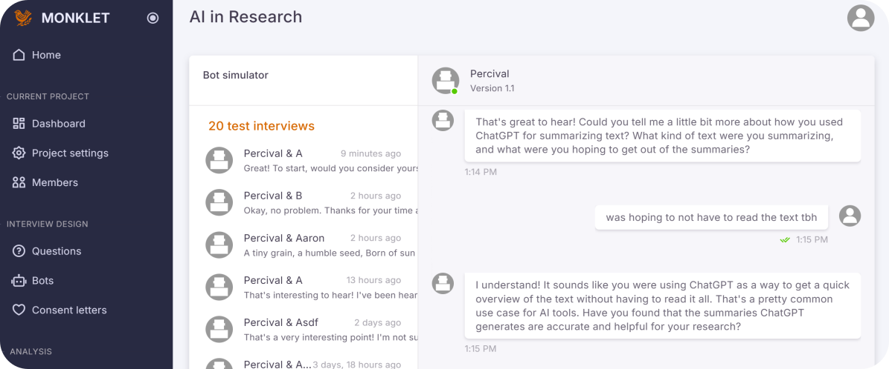

Monklet: Open-Source AI Interviewing
====================================

Monklet is a chat‑based interview platform built with Django 5 and Channels.

This tool is now open-source and is freely available to any researcher who wishes to use it. Anyone with a bit of patience should be able to get it working. If you get stuck, just give this file to your favourite LLM and ask for guidance.



Getting the tool running requires (at minimum) a copy of [Docker](https://www.docker.com/), a Google Gemini [API key](https://ai.google.dev/gemini-api/docs/api-key), and a copy of this source code. Limited Gemini API keys are available for free, but [make sure you understand](https://ai.google.dev/gemini-api/terms-archive/terms_02_05_25#data-use-unpaid) the privacy implications of using an unpaid key!

This directory is the root of the Monklet Django project and is intended to be used as a stand‑alone app. All command examples below assume your shell is already in this directory (next to `manage.py`, `docker-compose.yml`, etc.).

The instructions below cover both the traditional local workflow and a Docker‑based setup for running the full stack (PostgreSQL + Redis + Celery + Channels).

Docker‑based setup
------------------

Social scientists who are not programmers are recommended to use [Docker](https://www.docker.com/) to run the app. Docker is a tool that sets up and runs virtual computer servers ("containers") for you.

You can run Monklet using Docker and docker compose directly from this project directory.

Prerequisites:

- **Docker** and **docker compose** installed

1. **Create an `.env` file** with Django secrets and optional integrations:

   The contents of `.env` file should be as follows. You might like to use [this secret key generator](https://theorangeone.net/projects/django-secret-key-generator/). Get a Gemini API key [from Google](https://ai.google.dev/gemini-api/docs/api-key).
   ```
   SECRET_KEY="<secret key>"
   GEMINI_API_KEY="<Gemini API key>"
   RECAPTCHA_PUBLIC_KEY=
   RECAPTCHA_PRIVATE_KEY=
   MAILGUN_API_KEY=
   MAILGUN_DOMAIN=
   MAILGUN_API_URL=https://api.eu.mailgun.net/v3
   EMAIL_SENDER=support@mydomain.com
   ```

   Database and Redis settings are supplied by `docker-compose.yml` via environment
   variables and service names.

2. **Build and start the stack** from the project root:

   ```bash
   docker compose up --build -d
   ```

   This starts the following containers:

   - `web` (Django + Channels via `gunicorn` + `uvicorn.workers.UvicornWorker`)
   - `db` (PostgreSQL 16, database `monklet`)
   - `redis` (Redis 7)
   - `celery_worker` (Celery worker for background jobs)
   - `celery_beat` (Celery beat scheduler)

   The flag `-d` tells docker to run these services in the background.

3. **Run database migrations**:

   ```bash
   docker compose exec web python manage.py migrate
   ```

4. **Create an admin (superuser) account**:

   ```bash
   docker compose exec web python manage.py createsuperuser
   ```

   Follow the prompts to set the admin email and password. Use this account to log into the
   Django admin and any Monklet management interfaces.

5. **Access the app and admin**:

   - Application: `http://localhost:8765/`
   - Django admin: `http://localhost:8765/admin/`


Cloudflare Tunnel deployment (public studies from your desktop)
---------------------------------------------------------------

In addition to the local‑only Docker setup above, you can expose Monklet publicly using
**Cloudflare Tunnel**, so researchers can run a web‑accessible study from their own
machine without renting a server.

This uses an alternative compose file, `docker-compose.tunnel.yml`, which adds a
`cloudflared` service alongside the existing `web`, `db`, `redis`, `celery_worker`,
and `celery_beat` services.

### Prerequisites

- A domain managed by Cloudflare (DNS for e.g. `example.com` is on Cloudflare)
- A Cloudflare account (free plan is sufficient for tunnels)
- Docker + docker compose installed on the machine running Monklet

### Step 1 – Create a Cloudflare Tunnel and hostname

1. Log in to the Cloudflare dashboard and select your domain.
2. Open the **Zero Trust** dashboard (or **Access → Tunnels** depending on UI).
3. Click **Create tunnel**, name it something like `monklet-desktop`.
4. When prompted for the connector, choose the **Docker**/token‑based option.
   - Cloudflare will show a command similar to:
     `docker run cloudflare/cloudflared:latest tunnel --no-autoupdate run --token <TOKEN>`
   - Copy the `<TOKEN>` value only; you’ll use it as `CLOUDFLARE_TUNNEL_TOKEN`.
5. In the tunnel configuration, add a **Public hostname**:
   - Hostname: e.g. `study.example.com`
   - Type: `HTTP`
   - URL/Service: `http://web:8000`

   The `web` hostname here is the Docker Compose service name for the Django app,
   and port 8000 is the internal port exposed by `gunicorn` in the `web` container.

### Step 2 – Add the tunnel token to your environment

Add the token from the previous step to your `.env` file in the project root:

```
CLOUDFLARE_TUNNEL_TOKEN=YOUR_TOKEN_FROM_CLOUDFLARE
```

Make sure you do **not** commit a real production token to version control.

### Step 3 – Run Monklet with the tunnel compose file

From the project root, use the tunnel‑aware compose file:

```bash
docker compose -f docker-compose.tunnel.yml up --build
```

Then run migrations and create an admin (if you haven’t already):

```bash
docker compose -f docker-compose.tunnel.yml exec web python manage.py migrate
docker compose -f docker-compose.tunnel.yml exec web python manage.py createsuperuser
```

You can still access the app locally at `http://localhost:8765/`, and your
participants can use the public Cloudflare URL you configured, e.g.
`https://study.example.com/`.

To stop the study, press `Ctrl+C` in the terminal running compose or run:

```bash
docker compose -f docker-compose.tunnel.yml down
```

Local development (no Docker)
-----------------------------

To set up a local development environment you will need a python installation, as well as the prerequisite services (postgres database, redis, celery, postfix, etc). Note that while the codebase can run without a database server, using sqlite, it's better to develop against postgres.

To set up the web server locally on Ubuntu / Debian, first create the virtual environment:

```bash
make .venv
```

Run migrations, build the static assets, and create an admin account:

```bash
source .venv/bin/activate
python manage.py migrate
cd src && npm ci && npm run build:prod && cd ..
python manage.py collectstatic
python manage.py createsuperuser
```

Start the development server (ASGI via uvicorn, see `Makefile`):

```bash
make dev
```

This will run the app on port 8765 by default. In this mode, the project uses SQLite (when
`DEBUG=True`) and expects a local Redis and mail stack if you exercise those features.

**Local development with Docker backend (optional)**  
To run only the backing services in Docker (PostgreSQL, Redis, Celery) and the web app on your host:

```bash
docker compose -f docker-compose.dev.yml up -d
```

Then in your `.env` (or environment) set `DB_HOST=127.0.0.1`, `DB_PORT=5434`, `REDIS_HOST=127.0.0.1`, `REDIS_PORT=6379`, use a PostgreSQL database (e.g. switch off SQLite for that run), and start the app with `make dev`. Celery worker and beat run in containers; the app talks to db and Redis on localhost. Optional **Postfix** runs in the dev compose stack; with dev compose, use `EMAIL_HOST=127.0.0.1` and `EMAIL_PORT=1025` so the app sends mail via the container (Django’s SMTP backend).

Run tests:

```bash
make test
```

Environment wiring
------------------

The Docker setups use these key environment variables (see the compose files):

- **Database** (PostgreSQL, service `db`):
  - `DB_NAME=monklet`
  - `DB_USER=monklet`
  - `DB_PASSWORD=monklet`
  - `DB_HOST=db`
  - `DB_PORT=5432`

- **Redis / Celery / Channels**:
  - `CELERY_BROKER_URL=redis://redis:6379/0`
  - `CELERY_RESULT_BACKEND=redis://redis:6379/0`
  - `REDIS_HOST=redis`
  - `REDIS_PORT=6379`

- **Mail (optional)**  
  A **Postfix** container is included in both `docker-compose.yml` and `docker-compose.dev.yml`. It listens on port **587** inside the network and is published as **1025** on the host (so you can use `EMAIL_HOST=127.0.0.1`, `EMAIL_PORT=1025` when running the app on the host). From other containers use `EMAIL_HOST=postfix`, `EMAIL_PORT=587`. With `DEBUG=True`, set `EMAIL_BACKEND=django.core.mail.backends.smtp.EmailBackend` (or configure your `.env`) so Django uses SMTP instead of Mailgun.

These map into `config/settings.py` via environment variables and are suitable for
running in containers or other environments that provide the same values.


License
-------

This project is licensed under the **MIT License**. See the `LICENSE` file in this
directory for the full text.
